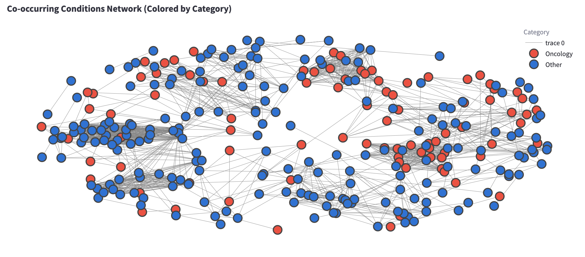

# Clinical Trials Explorer

A comprehensive Streamlit application for analyzing and visualizing clinical trials in Canada and globally, with specialized features for identifying and analyzing rare disease research.

## Key Features

- **Comprehensive Trial Exploration**: Search and filter pediatric and adult clinical trials with an intuitive interface.
- **Advanced Visualizations**: Interactive charts showing trial distributions by phase, status, year, and geography.
- **Sophisticated Geographic Analysis**:
  - Metropolitan area consolidation (Greater Toronto Area and Metro Vancouver)
  - Population-normalized visualizations showing trials per 100,000 residents
  - Provincial distribution with population adjustment
- **Global Clinical Trials Comparison**: Compare clinical trial activity across different countries worldwide.
  - Interactive choropleth maps showing global trial distribution
  - Country-by-country comparison of pediatric vs. adult trial proportions
  - Time trend analysis tracking clinical trial activity by country over time
  - Phase and status distribution comparisons across countries
- **AI-Powered Rare Disease Classification**: Identify rare disease trials using Anthropic's Claude API with detailed reasoning and confidence levels.
- **Specialized Analytics for Rare Diseases**:
  - Condition categorization (Oncology vs. Other)
  - Intervention type analysis
  - Condition co-occurrence networks
  - Intervention-condition relationship heatmaps




## Application Structure

```
├── Home.py                        # Landing page with navigation to modules
├── pages/
│   ├── 1_Pediatric_Clinical_Trials.py  # Pediatric trials exploration and visualization
│   ├── 2_Adult_Clinical_Trials.py      # Adult trials exploration and visualization
│   ├── 3_Rare_Disease_Trials.py        # Analytics for pre-classified rare disease trials
│   ├── 4_Rare_Disease_Classifier.py    # Tool to identify rare disease trials using Claude AI
│   └── 5_Global_Clinical_Trials_Comparison.py  # Global comparison of clinical trial activity
├── utils/                         # Utility modules
│   ├── api_utils.py               # API communication with Anthropic's Claude
│   ├── database_utils.py          # Database connection and query functions
│   ├── data_constants.py          # Reference data for cities, provinces, and mapping
│   ├── filtering_utils.py         # Trial filtering functionality
│   ├── session_state_utils.py     # Streamlit session state management
│   └── visualization_utils.py     # Advanced visualization components
├── data/
│   └── rare_disease_classification.csv  # Cached rare disease classifications
└── .streamlit/                    # Streamlit configuration
    └── secrets.toml               # Database credentials and API keys
```

## Installation and Setup

### Prerequisites

- Python 3.8+
- Access to the AACT database (requires registration)
- Anthropic API key (for rare disease classification)

### Step 1: Clone the repository

```bash
git clone https://github.com/yourusername/pediatric-trials-canada.git
cd pediatric-trials-canada
```

### Step 2: Create a virtual environment

```bash
python3 -m venv venv
source venv/bin/activate  # On Windows: venv\Scripts\activate
```

### Step 3: Install dependencies

```bash
pip install streamlit pandas plotly psycopg2-binary requests networkx
```

### Step 4: Configure secrets

Create a `.streamlit/secrets.toml` file with the following content:

```toml
[database]
host = "your-database-host"
port = 5432
dbname = "your-database-name"
user = "your-database-username"
password = "your-database-password"
ANTHROPIC_API_KEY = "your-anthropic-api-key"  # For rare disease classification
```

### Step 5: Launch the application

```bash
streamlit run Home.py
```

## Database Information

This application connects to the AACT (Aggregate Analysis of ClinicalTrials.gov) database, which contains structured data from ClinicalTrials.gov.

### Obtaining AACT Database Credentials

1. Register for an AACT account at: https://aact.ctti-clinicaltrials.org/users/sign_up
2. After registration, you'll receive connection credentials
3. Add these credentials to your `.streamlit/secrets.toml` file

## Rare Disease Classification

The rare disease classifier utilizes Anthropic's Claude AI to analyze trial information and determine if a trial is targeting a rare disease based on established criteria:

- In the US: affecting fewer than 200,000 people
- In Europe: affecting no more than 1 in 2,000 people
- Generally characterized by low prevalence, chronicity, and often genetic origin

### Obtaining an Anthropic API Key

1. Sign up for an Anthropic API account at: https://www.anthropic.com/
2. Generate an API key from your account dashboard
3. Add this key to your `.streamlit/secrets.toml` file under `ANTHROPIC_API_KEY`

## Metropolitan Area Consolidation

For more accurate geographic analysis, the application consolidates cities within major metropolitan areas:

1. **Greater Toronto Area (GTA)** - Includes Toronto, Mississauga, Brampton, Markham, Vaughan, and other GTA municipalities
2. **Metro Vancouver** - Includes Vancouver, Burnaby, Surrey, Richmond, and other Metro Vancouver municipalities

This consolidation provides a more meaningful picture of trial density in major urban centers.

## Usage Guide

### Home Page

The home page provides navigation to all application modules with descriptions of their functionality.

### Pediatric and Adult Clinical Trials Pages

These pages provide similar functionality for their respective age groups:

1. Use the sidebar filters to narrow down trials by status, phase, year, keywords, or conditions
2. View trial statistics and visualizations across various tabs:
   - Trial List: Basic information about all filtered trials
   - Charts: Distribution by phase, status, year, and age
   - Geographic Distribution: Trial locations across Canada with population-normalization
   - Interventions and Conditions: Analysis of trial focus areas
   - Trial Details: Detailed information about individual trials

### Global Clinical Trials Comparison

This page enables comparison of clinical trial activity across different countries worldwide:

1. Adjust settings in the sidebar:
   - Number of countries to display (5-30)
   - Minimum trial threshold for country inclusion 
   - Year range for time-based visualizations
   - Toggle pediatric trial analysis inclusion
2. Explore visualizations across four main tabs:
   - Countries Overview: Rankings, metrics, and detailed comparison tables
   - Geographic Distribution: Interactive choropleth maps of global trial distribution
   - Trends Over Time: Year-by-year analysis of trial activity by country
   - Trial Characteristics: Detailed breakdowns by:
     - Phase distribution by country
     - Pediatric vs. adult trial proportions
     - Trial status distribution (recruiting, active, completed, etc.)
3. Download data tables for further analysis

### Rare Disease Classifier

The rare disease classifier allows you to identify trials targeting rare diseases:

1. Filter the pediatric trials to find trials of interest
2. Choose to classify a single trial or all filtered trials
3. View classification results with AI-generated reasoning including:
   - Clear yes/no classification
   - Detailed reasoning
   - Confidence level assessment
   - Rare disease indicators
4. Export classification results for further analysis

### Rare Disease Trials

This specialized analytics page provides deeper insights into rare disease trials:

1. View pre-classified rare disease trials
2. Apply filters to focus on specific subsets
3. Explore various analytics tabs:
   - Charts: Distribution by phase, status, and year
   - Geographic Distribution: Where rare disease research is concentrated
   - Interventions & Conditions: Advanced analysis including:
     - Intervention type distribution
     - Top conditions by category
     - Condition co-occurrence networks
     - Intervention-condition relationship heatmaps
4. View detailed trial information including classification reasoning

## Contributing

Contributions to this project are welcome! Please feel free to submit a pull request or open an issue.

## License

This project is licensed under the MIT License - see the LICENSE file for details.

## Acknowledgments

- This application uses data from ClinicalTrials.gov via the AACT database
- Rare disease classification is powered by Anthropic's Claude AI
- Geographic visualization utilizes population data from Statistics Canada
