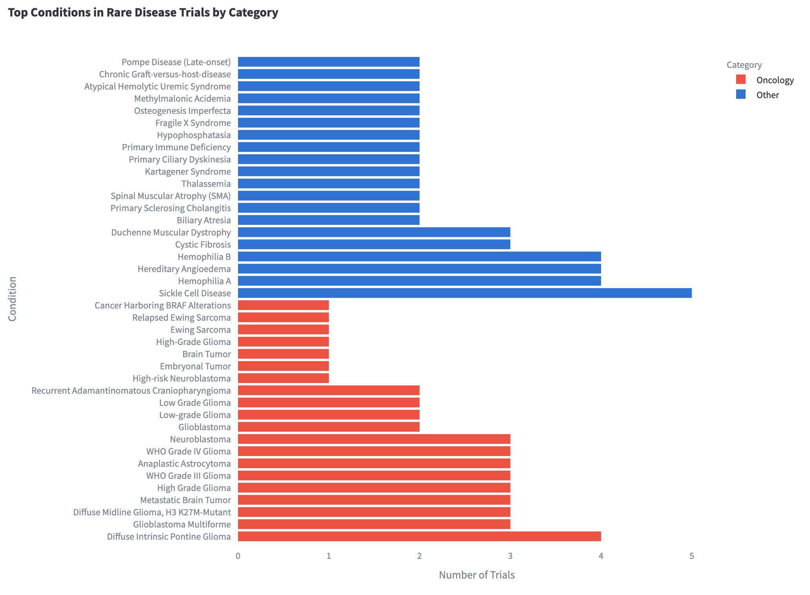
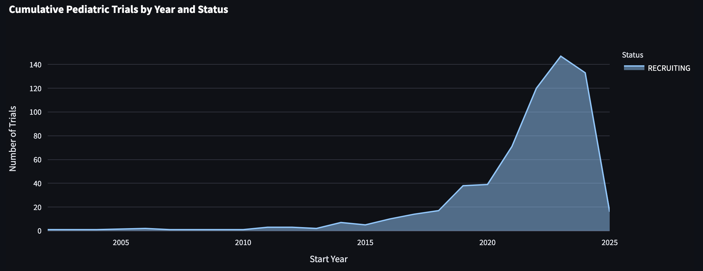
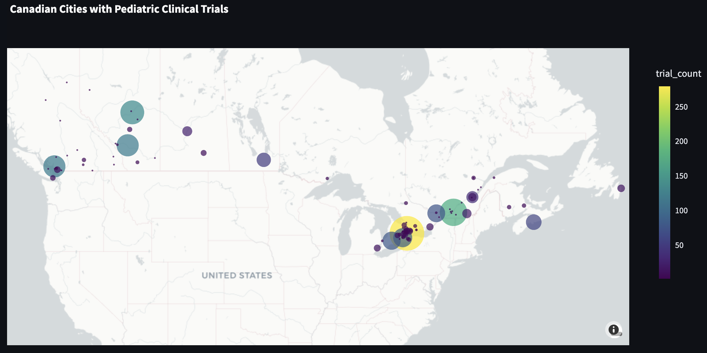

# Pediatric Clinical Trials in Canada

This Streamlit application visualizes pediatric clinical trials conducted in Canada and provides tools to identify rare disease trials.

## Features

- **Trial Search**: Search for pediatric clinical trials with various filters (status, phase, year, keywords, conditions)
- **Visualizations**: Interactive charts showing trial distributions by phase, status, year, and geography
- **Geographic Map**: Maps showing the distribution of trials across Canadian cities
- **Rare Disease Classification**: AI-powered classification of trials to identify those for rare diseases

## Project Structure

```
├── Home.py                      # Home page with trial search and visualizations
├── 1_Rare_Disease_Classifier.py # Rare disease classifier page
├── utils/                       # Utility modules
│   ├── api_utils.py             # API communication functions
│   ├── database_utils.py        # Database query functions
│   ├── filtering_utils.py       # Data filtering functions
│   ├── session_state_utils.py   # Session state management
│   └── visualization_utils.py   # Visualization functions
└── .streamlit/                  # Streamlit configuration
    └── secrets.toml             # Secrets file (database credentials and API keys)
```

## Setup Instructions

### 1. Clone the repository

```bash
git clone https://github.com/yourusername/pediatric-trials-canada.git
cd pediatric-trials-canada
```

### 2. Create a virtual environment

```bash
python -m venv .venv
source .venv/bin/activate  # On Windows: .venv\Scripts\activate
```

### 3. Install dependencies

```bash
pip install streamlit pandas plotly psycopg2-binary requests
```

### 4. Set up secrets

Create a `.streamlit/secrets.toml` file with the following content:

```toml
[database]
host = "your-database-host"
port = 5432
dbname = "your-database-name"
user = "your-database-username"
password = "your-database-password"
ANTHROPIC_API_KEY = "your-anthropic-api-key"  # For rare disease classification
```

### 5. Run the application

```bash
streamlit run Home.py
```

## Database

This application connects to the AACT (Aggregate Analysis of ClinicalTrials.gov) database, which contains information about clinical trials registered on ClinicalTrials.gov. You'll need access credentials to connect to this database.

### Obtaining AACT Database Credentials

1. Register for an AACT account at: https://aact.ctti-clinicaltrials.org/users/sign_up
2. After registration, you'll receive credentials for accessing the database
3. Add these credentials to your `.streamlit/secrets.toml` file

## Rare Disease Classification

The rare disease classifier uses Anthropic's Claude AI to analyze trial information and determine if a trial is targeting a rare disease. This feature requires an Anthropic API key.

### Obtaining an Anthropic API Key

1. Sign up for an Anthropic API account at: https://www.anthropic.com/
2. Generate an API key from your account dashboard
3. Add this key to your `.streamlit/secrets.toml` file under `ANTHROPIC_API_KEY`

## Usage Instructions

### Home Page

The home page displays all pediatric clinical trials with filtering options:

1. Use the sidebar filters to narrow down trials by status, phase, year, keywords, or conditions
2. View trial statistics and visualizations in the various tabs
3. Explore geographic distribution of trials across Canadian cities
4. View detailed information about individual trials

### Rare Disease Classifier

The rare disease classifier page allows you to identify trials targeting rare diseases:

1. Apply filters to find trials of interest
2. Select individual trials or analyze all filtered trials
3. View classification results with AI-generated reasoning
4. Export classification results for further analysis

## Contributing

Contributions to this project are welcome! Please feel free to submit a pull request or open an issue.

## License

This project is licensed under the MIT License - see the LICENSE file for details.





